# Afghan Verify

## National Academic Credential Registry

Afghan Verify is a secure platform for issuing, reviewing, managing, and publicly verifying academic credentials in Afghanistan. It connects universities, Ministry reviewers, graduates, employers, and verification organizations through one trusted registry.

The solution uses an ASP.NET Core 10 API, React 19 with TypeScript, SQL Server, ASP.NET Core Identity, JWT bearer authentication, university-scoped authorization, HMAC-SHA256 signatures, QR verification, SignalR notifications, and high-resolution A4 PDF export.

> Afghan Verify is production-oriented software. Official national deployment still requires authorized infrastructure, governance, privacy policies, operational monitoring, and secure key management.

---

## Key features

- University-prefixed credential codes such as `KU-491029481`.
- Public verification by archive code or QR scan.
- Diploma, transcript, and combined credential issuance.
- Ministry approval, rejection, suspension, reinstatement, revocation, and replacement workflows.
- HMAC-SHA256 integrity verification with versioned signing keys.
- Masked Tazkira data in public API responses.
- Excel and CSV transcript import with downloadable templates.
- High-definition A4 PDF export matching the active credential view.
- Multi-tier RBAC with server-enforced university scope.
- University, faculty, department, user, and audit-log management.
- Real-time credential status updates through SignalR.
- Responsive public pages and role-specific dashboards.

---

## Platform screenshots

### Public verification experience

<table>
  <tr>
    <td width="50%" align="center">
      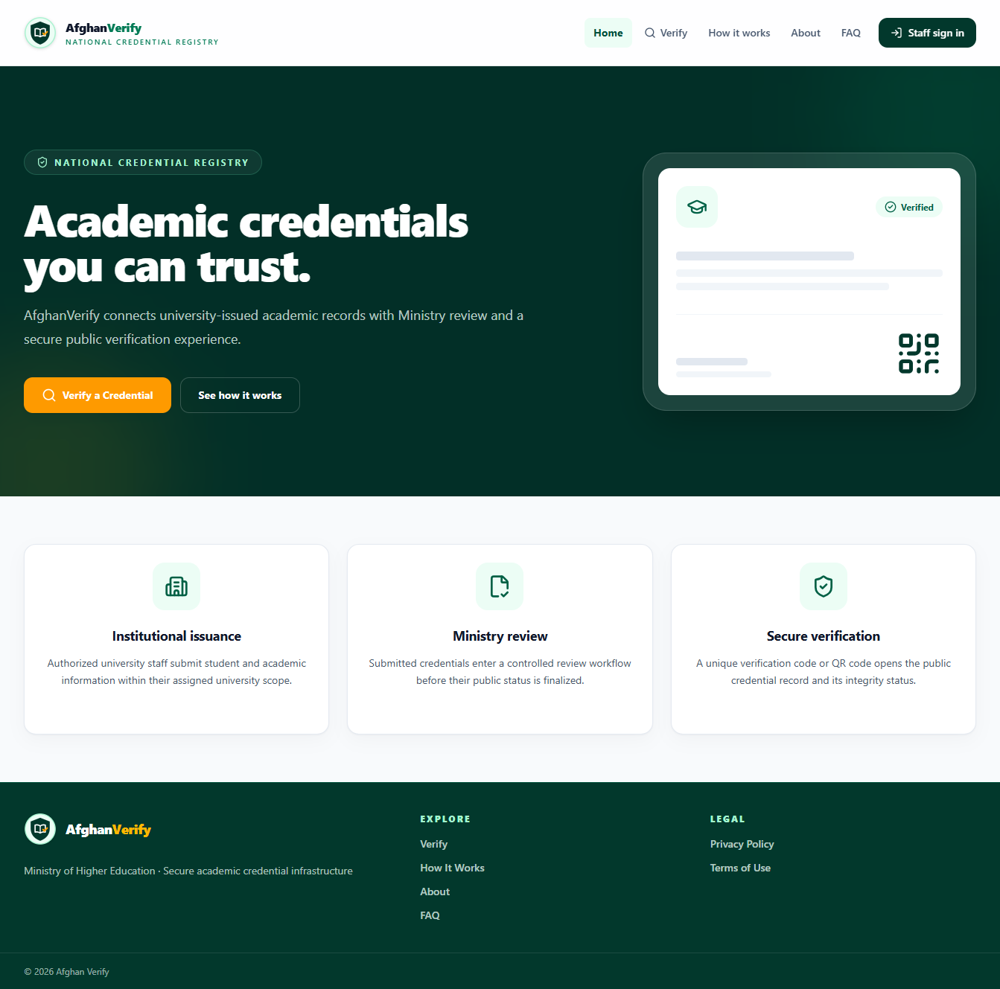
      <br /><strong>Public home page</strong>
    </td>
    <td width="50%" align="center">
      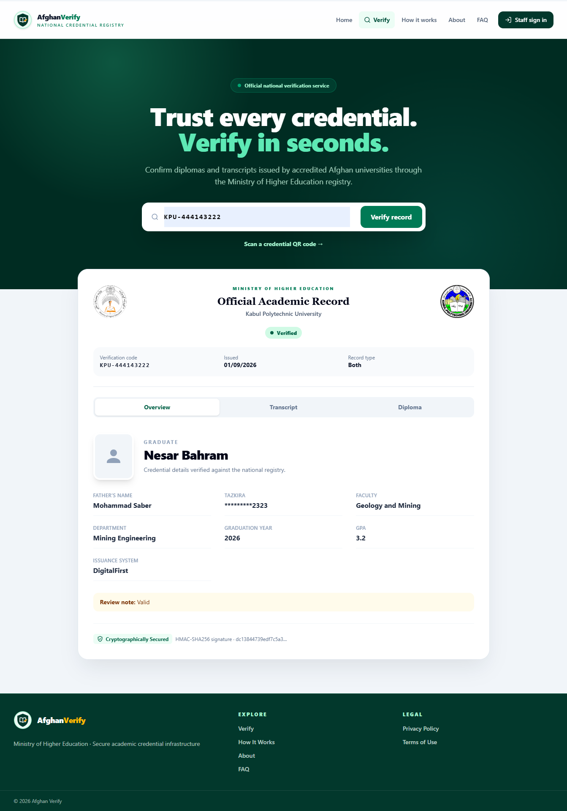
      <br /><strong>Credential verification result</strong>
    </td>
  </tr>
</table>

### Official credential views

<table>
  <tr>
    <td width="50%" align="center">
      
      <br /><strong>Verified diploma</strong>
    </td>
    <td width="50%" align="center">
      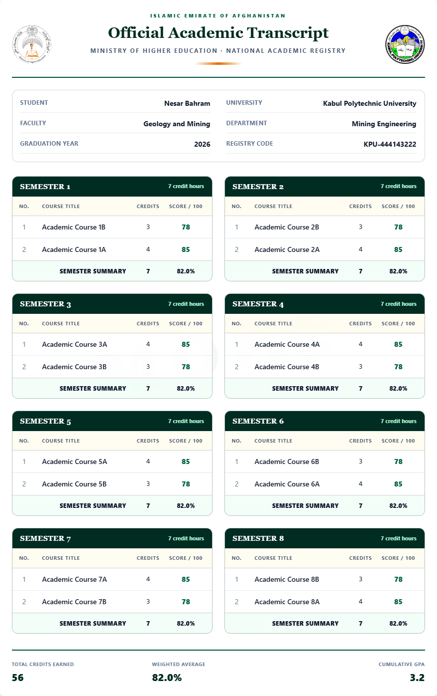
      <br /><strong>Verified transcript</strong>
    </td>
  </tr>
</table>

### University workspace

<table>
  <tr>
    <td width="50%" align="center">
      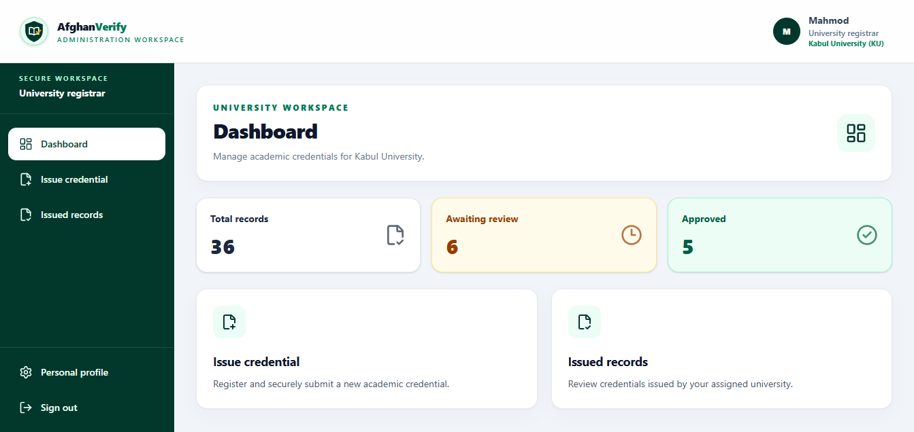
      <br /><strong>University dashboard</strong>
    </td>
    <td width="50%" align="center">
      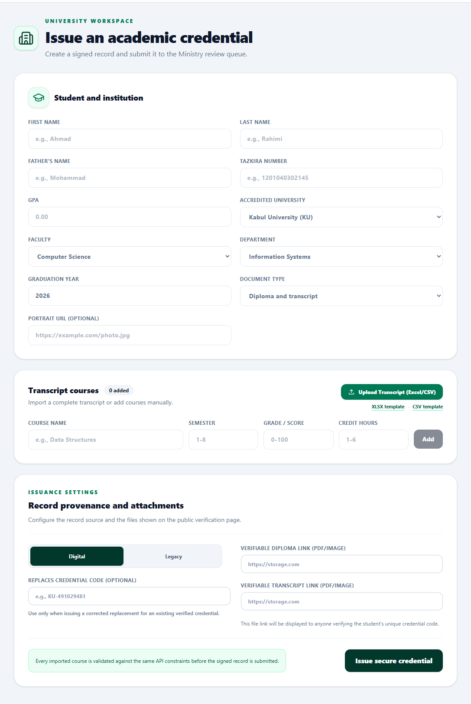
      <br /><strong>Issue credential</strong>
    </td>
  </tr>
  <tr>
    <td colspan="2" align="center">
      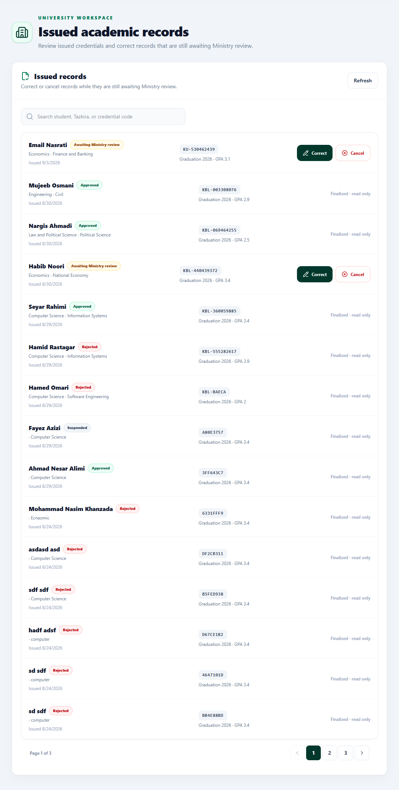
      <br /><strong>Issued records</strong>
    </td>
  </tr>
</table>

### Ministry workspace

<table>
  <tr>
    <td width="50%" align="center">
      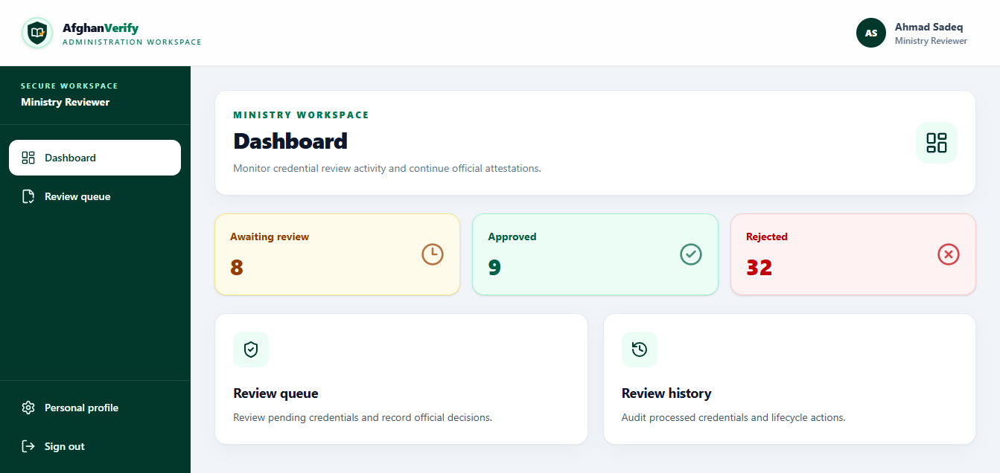
      <br /><strong>Ministry dashboard</strong>
    </td>
    <td width="50%" align="center">
      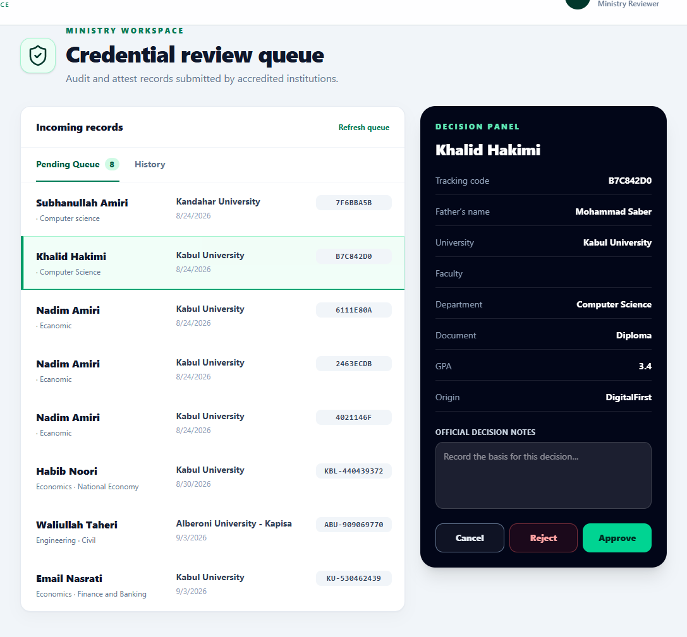
      <br /><strong>Credential review queue</strong>
    </td>
  </tr>
</table>

### Platform administration

<table>
  <tr>
    <td width="50%" align="center">
      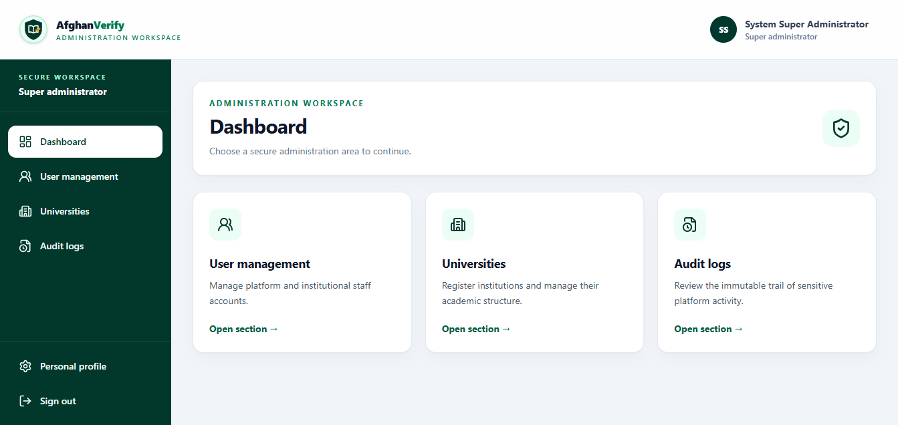
      <br /><strong>Super Admin dashboard</strong>
    </td>
    <td width="50%" align="center">
      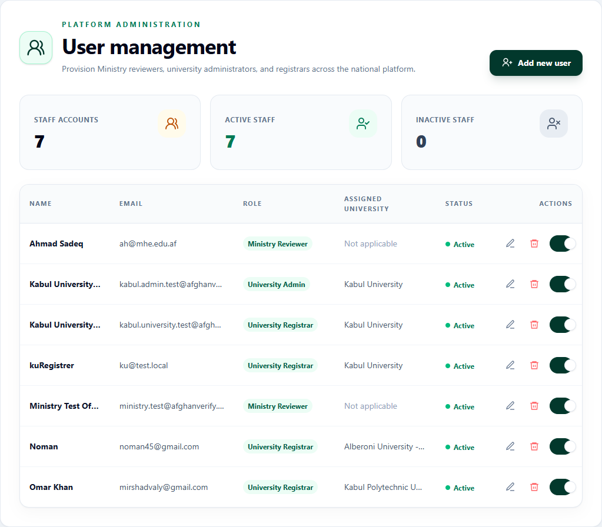
      <br /><strong>User management</strong>
    </td>
  </tr>
  <tr>
    <td width="50%" align="center">
      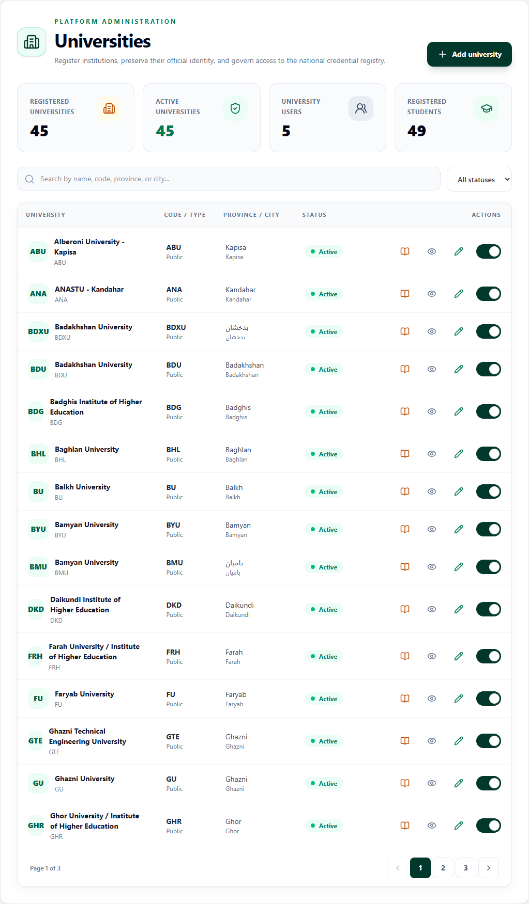
      <br /><strong>University management</strong>
    </td>
    <td width="50%" align="center">
      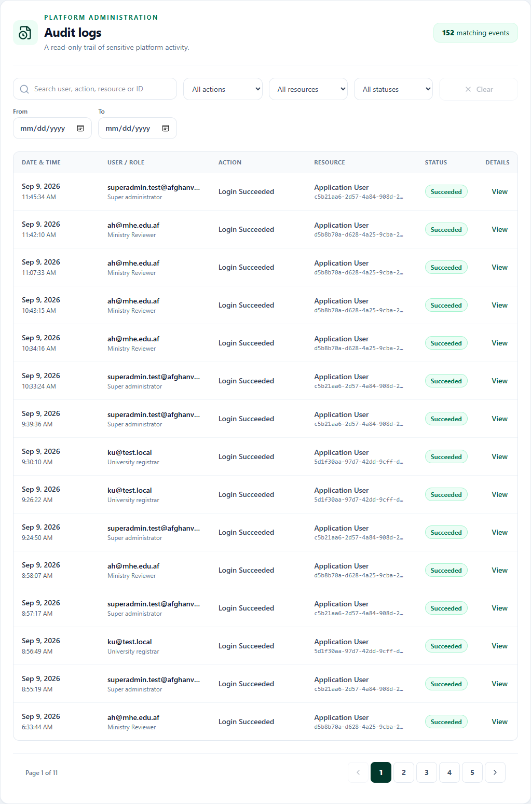
      <br /><strong>Audit logs</strong>
    </td>
  </tr>
</table>

---

## Public website

The public experience includes:

- **Home** — introduces Afghan Verify and its primary verification service.
- **Verify** — searches by archive code or scans a credential QR code.
- **How It Works** — explains the university-to-Ministry workflow.
- **About** — describes the platform, its users, and its purpose.
- **FAQ** — answers common verification questions.
- **Privacy Policy** and **Terms of Use** — linked from the shared footer.
- **Staff Sign In** — securely opens internal role-based workspaces.

Public verification supports trusted, pending, rejected, suspended, revoked, superseded, and cancelled states. The full Tazkira number is never returned by the public verification API.

---

## Roles and access

| Role | Scope | Capabilities |
| --- | --- | --- |
| `SUPER_ADMIN` | National | Manage universities, academic structures, users, and audit logs |
| `UNIVERSITY_ADMIN` | Assigned university | Manage registrar accounts within the same university |
| `University` | Assigned university | Issue and manage the university's academic credentials |
| `Ministry` | Ministry | Review credentials and manage their verified lifecycle |

University scope is enforced by the backend using the signed `university_id` JWT claim. Frontend filtering improves usability but is not treated as a security boundary.

### University workspace

- Issue diploma, transcript, or combined credentials.
- Select active faculties and departments belonging to the authenticated institution.
- Enforce alphabetic student names across Latin and Arabic-derived scripts.
- Validate an exact 13-digit Afghanistan e-Tazkira number.
- Validate GPA, graduation year, document links, semesters, scores, and credit hours.
- Support up to 14 semesters for applicable medical faculties.
- Import transcript courses from Excel or CSV.
- Display the generated verification code and QR code immediately.
- Browse issued records with responsive pagination.
- Open complete credential details from interactive record cards.
- Correct and re-sign pending credentials.
- Cancel pending records with an official reason.
- Create linked replacements for verified credentials.

### Ministry workspace

- Review credentials in a focused pending queue.
- Approve or reject records with official decision notes.
- Require a reason before rejection.
- Move processed records into searchable, paginated history.
- Search by student, university, or archive code.
- Inspect history records in a read-only details panel.
- View weekly, monthly, or yearly operational statistics.
- Suspend, reinstate, revoke, or supersede verified credentials.
- Receive live status changes through SignalR.

### Super Admin workspace

- Create, view, edit, activate, and deactivate universities.
- Enforce unique university codes and duplicate-name checks.
- Upload, preview, replace, and remove university logos.
- Validate PNG, JPG/JPEG, and WebP images up to 5 MB.
- Assign existing University Admin accounts.
- Manage multiple faculties per university.
- Manage multiple departments per faculty.
- Preserve historical records when an institution or academic unit is deactivated.
- Create, edit, activate, deactivate, and soft-delete staff accounts.
- Search and paginate immutable audit events.

### Personal account settings

Every authenticated user can view their dynamic identity summary and securely change their own password after confirming the current password. Forgotten-password recovery uses expiring ASP.NET Core Identity tokens and an institutional SMTP provider.

---

## Academic data model

```text
University
├── University Administrators
├── Registrars
├── Faculties
│   └── Departments
│       └── Students
└── Credentials
    ├── Transcript Courses
    ├── Ministry Decisions
    └── Audit History
```

- A university can have multiple faculties.
- Each faculty belongs to one university and can have multiple departments.
- Each department belongs to one faculty.
- Duplicate faculty names within a university are rejected.
- Duplicate department names within a faculty are rejected.
- Deactivation is non-destructive and retains historical students and credentials.

---

## Credential lifecycle

```text
University Registrar
        │
        │ Issues a signed credential
        ▼
Pending Ministry Review
        ├── Correct ──► Re-sign and return to queue
        ├── Cancel  ──► Preserve as cancelled history
        ├── Reject  ──► Store official rejection notes
        └── Approve ──► Publish as verified
                              ├── Suspend
                              ├── Reinstate
                              ├── Revoke
                              └── Replace ──► Supersede original
```

Approved credentials are not silently overwritten. A correction after approval creates a linked replacement and preserves the original record.

---

## Security and data integrity

### Authentication

- ASP.NET Core Identity stores salted password hashes.
- JWT bearer tokens carry role and institution scope.
- Security-stamp validation invalidates sessions after password changes, deactivation, deletion, or lockout.
- Repeated failed logins are protected by account-lockout controls.
- Private API routes require a valid bearer token.
- Password-recovery responses reduce account enumeration and are rate limited.

### Cryptographic integrity

- Credentials are signed using keyed HMAC-SHA256.
- Secrets are loaded from configuration or deployment secret stores.
- Versioned key identifiers support controlled key rotation.
- Canonical length-prefixed payloads prevent ambiguous concatenation.
- Signatures cover student identity, academic data, institution, document URLs, issue date, archive code, replacement relationships, and transcript courses.
- Fixed-time comparison is used during verification.
- Unauthorized signed-field changes invalidate the signature.

### Persistence and authorization

- Verification codes use cryptographically secure random generation.
- A unique database index and collision retries protect archive-code allocation.
- Serializable issuance transactions preserve consistency.
- Optimistic concurrency protects review and correction operations.
- Staff deletion uses soft deletion.
- Client-supplied university, faculty, and department IDs are checked against authenticated server scope.
- Sensitive administrative actions are written to audit history visible only to Super Admin.

### Logo upload

- File extensions, MIME types, and size are validated.
- Server-generated filenames prevent path traversal and unsafe client filenames.
- Only the stored file reference is persisted in the database.
- Logo replacement and removal require Super Admin authorization.

---

## Architecture

```text
React 19 + TypeScript + Tailwind CSS
                 │
                 │ HTTPS / JWT / SignalR
                 ▼
         ASP.NET Core 10 Web API
                 │
       ┌─────────┴──────────┐
       │                    │
ASP.NET Core Identity   Application Services
       │                    │
       └─────────┬──────────┘
                 ▼
        Entity Framework Core 10
                 │
                 ▼
              SQL Server
```

- `AfghanVerify.Core` — domain entities and credential lifecycle definitions.
- `AfghanVerify.Infrastructure` — EF Core, Identity, cryptography, migrations, and SignalR.
- `AfghanVerify.WebApi` — controllers, DTOs, authorization, audit services, email recovery, logo storage, and configuration.
- `AfghanVerify.Infrastructure.Tests` — security, validation, persistence, and authorization-contract tests.

---

## Technology stack

| Area | Technology |
| --- | --- |
| Frontend | React 19, TypeScript 6, Vite 8, Tailwind CSS 4 |
| Routing | React Router 7 |
| Backend | ASP.NET Core 10 Web API |
| Authentication | ASP.NET Core Identity and JWT Bearer |
| Database | SQL Server and Entity Framework Core 10 |
| Cryptography | HMAC-SHA256 and secure random generation |
| Real-time | ASP.NET Core SignalR |
| PDF export | html2canvas and jsPDF |
| Transcript import | ExcelJS and CSV parsing |
| QR support | QR generation and camera scanning |
| UI icons | Lucide React |
| Containers | Docker Compose, .NET runtime, Node.js build, and Nginx |
| Testing | xUnit, TypeScript compiler, ESLint, and Vite |

---

## Repository structure

```text
AfghanVerify/
├── frontend/
│   ├── public/
│   └── src/
│       ├── assets/
│       ├── components/
│       ├── features/
│       │   ├── account/
│       │   ├── admin/
│       │   ├── ministry-portal/
│       │   ├── university-portal/
│       │   └── verification/
│       ├── App.tsx
│       └── Login.tsx
├── src/
│   ├── AfghanVerify.Core/
│   ├── AfghanVerify.Infrastructure/
│   └── AfghanVerify.WebApi/
├── tests/
│   └── AfghanVerify.Infrastructure.Tests/
├── .env.example
├── docker-compose.yml
├── AfghanVerify.slnx
└── README.md
```

---

## Prerequisites

- [.NET 10 SDK](https://dotnet.microsoft.com/)
- Node.js 20 or newer
- npm
- SQL Server 2022, SQL Server Express, or a compatible instance
- Git

---

## Local setup

### 1. Clone and restore dependencies

```powershell
git clone https://github.com/HasibSayeedi/AfghanVerify.git
Set-Location AfghanVerify
dotnet restore AfghanVerify.slnx

Set-Location frontend
npm install
Set-Location ..
```

### 2. Configure secrets

Create the ignored file `src/AfghanVerify.WebApi/appsettings.Local.json`:

```json
{
  "ConnectionStrings": {
    "DefaultConnection": "Server=.\\SQLEXPRESS;Database=AfghanVerifyDb;Trusted_Connection=True;MultipleActiveResultSets=true;Encrypt=False;TrustServerCertificate=True"
  },
  "Jwt": {
    "Key": "replace-with-a-strong-random-secret-of-at-least-32-characters"
  },
  "Cryptography": {
    "ActiveKeyId": "primary",
    "SigningKey": "replace-with-a-base64-encoded-random-key-of-at-least-32-bytes"
  },
  "Email": {
    "Host": "smtp.example.gov.af",
    "Port": 587,
    "Username": "no-reply@example.gov.af",
    "Password": "replace-with-an-smtp-credential",
    "FromAddress": "no-reply@example.gov.af",
    "FromName": "Afghan Verify",
    "EnableSsl": true
  },
  "PasswordRecovery": {
    "FrontendBaseUrl": "http://localhost:5173",
    "TokenLifetimeMinutes": 30
  }
}
```

Never commit real JWT keys, HMAC keys, SMTP credentials, connection strings, bootstrap passwords, `.env`, or `appsettings.Local.json`.

Generate separate JWT and HMAC secrets:

```powershell
$jwtBytes = [Security.Cryptography.RandomNumberGenerator]::GetBytes(64)
$hmacBytes = [Security.Cryptography.RandomNumberGenerator]::GetBytes(32)
[Convert]::ToBase64String($jwtBytes)
[Convert]::ToBase64String($hmacBytes)
```

Environment-variable equivalents use double underscores:

```dotenv
Jwt__Key=replace-with-a-strong-jwt-secret
Cryptography__SigningKey=replace-with-a-base64-hmac-key
ConnectionStrings__DefaultConnection=replace-with-your-connection-string
Email__Host=smtp.example.gov.af
Email__Port=587
Email__Username=no-reply@example.gov.af
Email__Password=replace-with-an-smtp-credential
Email__FromAddress=no-reply@example.gov.af
Email__EnableSsl=true
PasswordRecovery__FrontendBaseUrl=http://localhost:5173
```

### 3. Apply EF Core migrations

```powershell
dotnet ef database update `
  --project src/AfghanVerify.Infrastructure `
  --startup-project src/AfghanVerify.WebApi
```

Use a controlled migration job in production and multi-instance deployments.

### 4. Run the backend

```powershell
dotnet run --project src/AfghanVerify.WebApi --launch-profile https
```

### 5. Run the frontend

```powershell
Set-Location frontend
npm run dev
```

Open `http://localhost:5173`.

For a separately hosted API, create the ignored file `frontend/.env.local`:

```dotenv
VITE_API_BASE_URL=https://localhost:7267
VITE_PUBLIC_VERIFY_BASE_URL=http://localhost:5173
```

---

## Password recovery

Password recovery requires a working SMTP account. `Email:Host` must contain only the SMTP hostname—not an `https://` or `smtp://` URL. Use a provider-issued application password where supported and restart the API after changing email configuration.

---

## Docker

The Compose deployment includes:

- `frontend` — multi-stage Vite build served by Nginx.
- `backend` — ASP.NET Core 10 Web API.
- `database` — SQL Server with persistent storage.

```powershell
Copy-Item .env.example .env
docker compose up --build -d
docker compose ps
```

Replace every placeholder in `.env` first. The application is exposed at `http://localhost:8080`.

```powershell
docker compose logs -f backend
docker compose restart backend
docker compose down
```

`docker compose down` preserves the database volume. Adding `--volumes` intentionally deletes container data.

---

## Build and test

Backend:

```powershell
dotnet build AfghanVerify.slnx --configuration Release
dotnet test AfghanVerify.slnx --configuration Release
```

Frontend:

```powershell
Set-Location frontend
npm run lint
npm run build
```

Automated coverage includes cryptographic tamper detection, key-version signatures, persistence behavior, validation contracts, Tazkira rules, and controller authorization metadata.

---

## Selected API routes

| Method | Route | Access |
| --- | --- | --- |
| `POST` | `/api/auth/login` | Public |
| `POST` | `/api/auth/forgot-password` | Public, rate limited |
| `POST` | `/api/auth/reset-password` | Public with reset token |
| `PUT` | `/api/account/password` | Authenticated staff |
| `GET` | `/api/universities` | Public |
| `GET` | `/api/verify/{code}` | Public |
| `GET` | `/health/live` | Public liveness probe |
| `GET` | `/health/ready` | Public readiness probe |
| `POST` | `/api/certificates/issue` | University Registrar |
| `GET` | `/api/certificates/issued` | University Registrar, university scoped |
| `PUT` | `/api/certificates/{code}/pending` | University Registrar, pending only |
| `POST` | `/api/certificates/{code}/cancel` | University Registrar, pending only |
| `GET` | `/api/ministry/queue` | Ministry Reviewer |
| `GET` | `/api/ministry/history-page` | Ministry Reviewer |
| `GET` | `/api/ministry/statistics` | Ministry Reviewer |
| `POST` | `/api/ministry/review` | Ministry Reviewer |
| `POST` | `/api/ministry/lifecycle` | Ministry Reviewer |
| `GET/POST/PUT/PATCH` | `/api/admin/users` | Super Admin or scoped University Admin |
| `GET/POST/PUT` | `/api/admin/universities` | Super Admin |
| `POST/PUT` | `/api/admin/universities/{id}/faculties` | Super Admin |
| `POST/PUT` | `/api/admin/universities/{id}/faculties/{facultyId}/departments` | Super Admin |
| `GET` | `/api/admin/audit-logs` | Super Admin |
| SignalR | `/notificationHub` | Application clients |

---

## Production checklist

- Store JWT, HMAC, SMTP, database, and bootstrap secrets in a managed secret store.
- Use independent high-entropy values for JWT and HMAC signing.
- Persist ASP.NET Core Data Protection keys across restarts.
- Establish tested key-rotation and recovery procedures.
- Terminate TLS at a trusted reverse proxy and enforce HTTPS.
- Restrict CORS to approved frontend origins.
- Apply a restrictive Content Security Policy.
- Use a least-privilege SQL Server account.
- Encrypt backups and test restoration regularly.
- Store diploma, transcript, and logo files in durable controlled storage.
- Use controlled or expiring document URLs where required.
- Configure monitored institutional SMTP delivery.
- Disable bootstrap accounts after initial provisioning.
- Centralize logs without recording passwords, tokens, full Tazkira numbers, or signing secrets.
- Monitor authentication failures, audit events, lifecycle actions, email delivery, and database health.
- Apply migrations through a controlled deployment process.
- Run all tests, lint checks, and production builds before release.

---

## Updating GitHub

```powershell
git status
git add README.md
git commit -m "docs: update project documentation"
git pull --rebase origin main
git push origin main
```

When using a feature branch, replace `main` with the current branch name. Never force-add ignored secret files.

---

## Responsible data handling

Academic credentials and national identity information are sensitive. Production operators are responsible for lawful processing, access governance, retention rules, incident response, backup protection, key management, audit review, and secure document storage.

---

## License

Afghan Verify is distributed under the [MIT License](LICENSE).

Copyright (c) 2026 Hasibullah Sayeedi.
